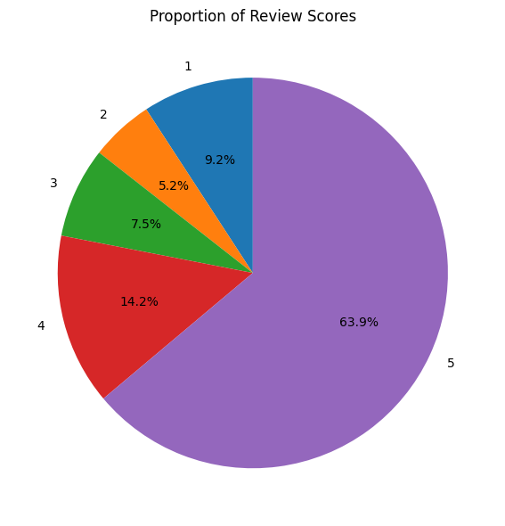
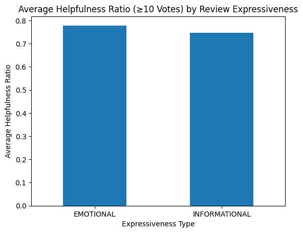
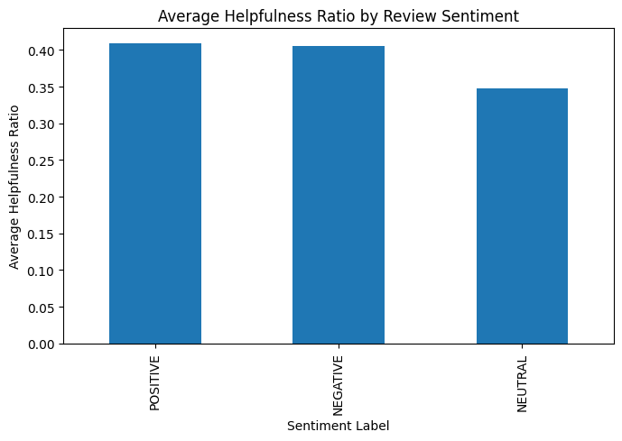

# 📊 Understanding Review Helpfulness in Online Marketplaces

Even though online reviews are not equally helpful, they play important role when consumer is making decision. This project applies machine learning and text-as-data methods to examine how consumers express opinions in product reviews and how these expressions influence others

Using the **Amazon Fine Food Reviews dataset**, we perform sentiment analysis and investigate linguistic and stylistic features that affect how much value other users assign to a review.

## 🎯 Research Objectives

In addition to **sentiment analysis (positive vs. negative)**, this project addresses the following questions:

* **Are emotionally expressive reviews or informational reviews more helpful to consumers?**
* **Does review length increase perceived credibility and helpfulness?**
* **Are negative reviews perceived as more helpful than positive reviews?**

Together, these questions explore how **tone, content, and effort** shape trust in online reviews.

## 📂 Dataset

**Amazon Fine Food Reviews Dataset**
🔗 [https://www.kaggle.com/datasets/snap/amazon-fine-food-reviews](https://www.kaggle.com/datasets/snap/amazon-fine-food-reviews)

### Dataset Features

* `ProductId`, `UserId`, `ProfileName`
* `HelpfulnessNumerator`, `HelpfulnessDenominator`
* `Score` (numeric rating)
* `Time` 
* `Summary`, `Text` (review content)

**Unit of analysis:** Individual product review

## ⚠️ Dataset Setup Instructions (Required)

Due to GitHub’s file size limitations (the dataset exceeds **100MB**), the dataset is **not included in this repository**.

To run the project successfully:

1. Download the dataset from Kaggle using the link above.
2. Place the downloaded file into the project directory.
3. Rename the file from **`Reviews.csv`** to **`reviews.csv`** (lowercase), as the code expects this exact filename.

## 🛠️ Methods Used

* Sentiment analysis
* Text preprocessing and feature extraction
* Statistical comparison of review characteristics
* Machine learning models for classification and interpretation

## 🎓 Course Information

**Course:** SOSC 314

---

## End-to-End Pipeline

**Pipeline logic:**

Raw review dataset
→ Data exploration & preprocessing
→ Text feature construction (length, sentiment, subjectivity)
→ Helpfulness ratio computation
→ Statistical testing (z-tests)
→ Regression analysis
→ Visualization & interpretation

---

## Key Findings

**All findings are based on z-tests and linear regression analyses.**

1. **Are emotionally expressive reviews or informational reviews more helpful to consumers?**
   Emotionally expressive reviews were found to be **more helpful on average** than informational reviews, particularly among reviews with a sufficient number of helpfulness votes. This suggests that emotional tone increases perceived usefulness.

2. **Does review length increase perceived credibility and helpfulness?**
   Yes. Linear regression results show a **positive and statistically significant relationship** between review length and helpfulness, indicating that longer reviews tend to be perceived as more credible and informative.

3. **Are negative reviews perceived as more helpful than positive reviews?**
   Yes. Negative reviews received **higher average helpfulness ratios** than positive reviews, suggesting that consumers find critical information more diagnostic and useful.

---

## Review Helpfulness Overview

The dataset contains consumer reviews with varying lengths, emotional tones, and sentiment polarities. Helpfulness is measured using a **helpfulness ratio**, capturing how useful a review is perceived by other users.

---

## Notebook: [`CourseProjectReviews.ipynb.ipynb`](code/CourseProjectReviews.ipynb.ipynb)

---

## 1. Import & Load

* Loaded the review dataset using `pandas`
* Verified dataset structure, column names, and data types
* Filtered invalid or incomplete helpfulness entries

---

## 2. Initial Exploration

* Examined sample reviews and associated helpfulness votes
* Analyzed distribution of review length
* Inspected sentiment polarity and subjectivity distributions

This step ensured the dataset was suitable for textual and statistical analysis.

---

## 3. Text Preprocessing

Steps applied to the review text:

* Converted text to lowercase
* Removed punctuation and special characters
* Tokenized reviews
* Computed word counts to measure **review length**

Preprocessing ensured consistency and reliable feature extraction.

---

## 4. Feature Engineering

Constructed key analytical variables:

* **Helpfulness ratio** = helpful votes / total votes
* **Review length** (word count)
* **Sentiment polarity** (TextBlob; –1 to +1)
* **Subjectivity score** to distinguish emotional vs informational reviews

Reviews were categorized based on sentiment polarity and subjectivity thresholds.

---

## 5. Research Question 1: Emotional vs. Informational Reviews

To examine whether emotionally expressive reviews are more helpful than informational ones:

* Reviews were classified using **subjectivity scores**
* Mean helpfulness ratios were compared using **z-tests**
* Analyses were repeated on high-vote subsets for robustness

---

## 6. Research Question 2: Review Length and Helpfulness

To assess whether longer reviews are perceived as more credible and helpful:

* **Linear regression** was used with helpfulness ratio as the dependent variable
* Review length served as the primary predictor
* Results showed a positive association between length and helpfulness

---

## 7. Research Question 3: Positive vs. Negative Reviews

To determine whether negative reviews are more helpful than positive ones:

* Sentiment polarity scores were categorized into positive and negative
* Mean helpfulness ratios were compared using **two-sample z-tests**
* Neutral reviews were excluded to sharpen contrast

---

## 8. Statistical Summary

Methods used:

* Descriptive statistics
* Two-sample **z-tests**
* **Linear regression**
* Visual inspection through bar charts and scatter plots

These methods provided complementary statistical and visual evidence.

---

## Scope

* Focuses on **perceived helpfulness**, not actual purchase behavior
* Examines textual features of reviews, not reviewer demographics
* Limited to one review platform and product context
* Intended for exploratory and educational analysis

---

## Limitations

* Observational data prevents causal inference
* Automated sentiment analysis may miss nuance, sarcasm, or context
* Helpfulness votes may be influenced by visibility or timing effects
* Classifications depend on threshold choices for sentiment and subjectivity

---

## Conclusion

This project demonstrates that **how reviews are written matters**. Emotionally expressive reviews, longer reviews, and negative reviews tend to be perceived as more helpful by consumers. These findings highlight the importance of emotional tone and informational depth in shaping consumer judgment and trust in online review platforms.
